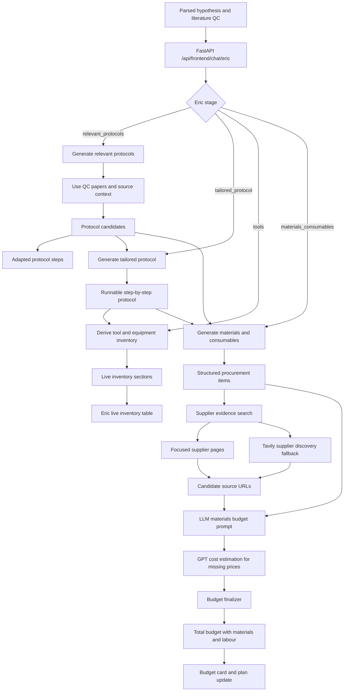
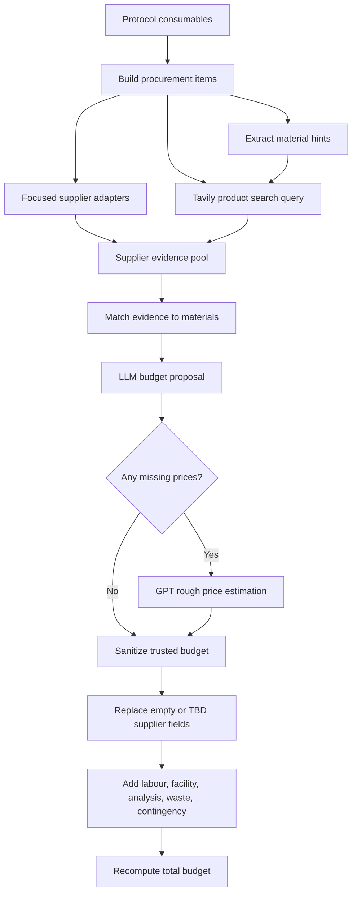

# Eric Agent Workflow

Eric is the lab logistics agent. He converts Rachael's scientific context into protocol steps, inventory requirements, materials, and a full procurement budget.

## Key Technical Bits

- Protocol candidates are generated from literature QC and relevant source context.
- Each candidate carries adapted steps so the demo shows how papers become practical workflow steps.
- The tailored protocol becomes the source of truth for equipment and tool extraction.
- Tool inventory is rendered once as the live inventory table and can be edited by the user.
- Consumables become structured procurement items with expected quantity, unit size, specification, supplier hint, and intended use.
- Supplier discovery uses focused adapters for known suppliers and Tavily fallback queries for broader product/source search.
- The supplier query includes trusted supplier site filters such as Thermo Fisher, Sigma-Aldrich, Promega, QIAGEN, IDT, Addgene, and ATCC.
- The budget path uses GPT to estimate missing costs, then a backend finalizer prevents `TBD` suppliers and adds labour, facility time, analysis, waste/safety, and contingency.

## Procurement And Budgeting Detail

