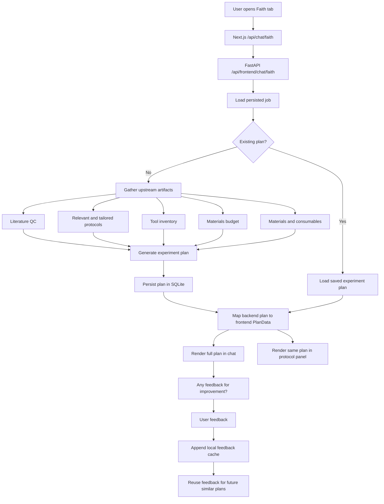
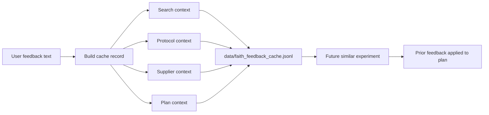

# Faith Agent Workflow

Faith is the synthesis agent. She combines Rachael's scientific QC and Eric's protocol/logistics artifacts into the final experiment plan, then asks the user for improvement feedback.

## Key Technical Bits

- Faith does not regenerate everything from scratch; she loads persisted job artifacts from SQLite.
- The final plan is generated from the approved scientific context, protocol, inventory, materials, and budget.
- The frontend maps the backend plan into `PlanData` so the chat card and protocol side panel stay aligned.
- Faith's visible response after the plan is a direct feedback prompt: `Any feedback for improvement?`
- User feedback is appended to a local JSONL cache with search context, protocol context, supplier context, and plan context.
- Related historical feedback can be reused by future plan generation, which creates a lightweight improvement loop.

## Feedback Cache Detail

