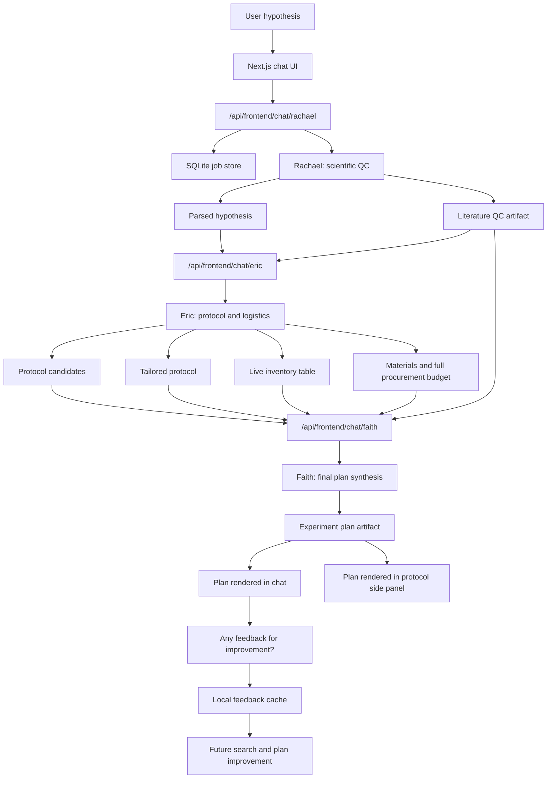
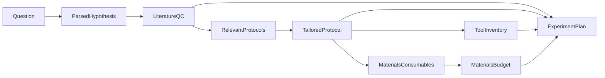

# Overall Workflow

The system is a staged artifact pipeline. The chat UI feels conversational, but each agent produces structured backend artifacts that are persisted and reused downstream.

## Key Technical Bits

- The frontend lives in `Frontend_Final` and proxies persona calls through Next.js API routes.
- The backend lives in `ai_scientist` and exposes FastAPI endpoints for Rachael, Eric, and Faith.
- SQLite stores the job state, intermediate artifacts, final plans, and review metadata.
- Artifacts move forward as typed JSON contracts, not loose chat text.
- Optional live integrations improve the demo but are not mandatory: OpenAI/Anthropic for LLM tasks, Tavily for web/supplier search, and public literature APIs for QC.

## Artifact Chain

