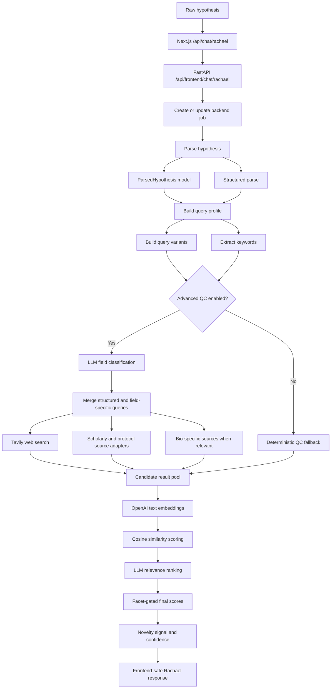
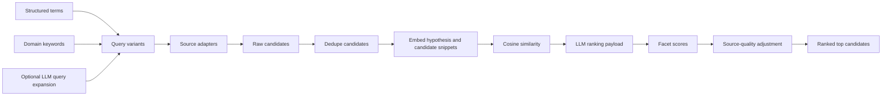

# Rachael Agent Workflow

Rachael is the scientific validation agent. Her job is to turn a raw hypothesis into structured scientific context and a literature QC signal.

## Key Technical Bits

- `build_query_profile` creates strict, broad, and protocol-focused query variants.
- `extract_keywords` seeds domain-specific and hypothesis-specific search terms.
- Advanced QC can classify the field, expand the search plan, and query Tavily plus scholarly/protocol adapters.
- Candidate titles and snippets are embedded with the configured embedding model, defaulting to `text-embedding-3-small`.
- Cosine similarity gives a semantic relevance score between the user hypothesis and each candidate.
- An LLM ranking step adds facet-aware relevance judgments such as system match, intervention match, outcome match, and novelty relevance.
- The final literature QC artifact includes source coverage, query variants, candidate count, top candidates, novelty signal, and confidence.

## Search And Ranking Detail

